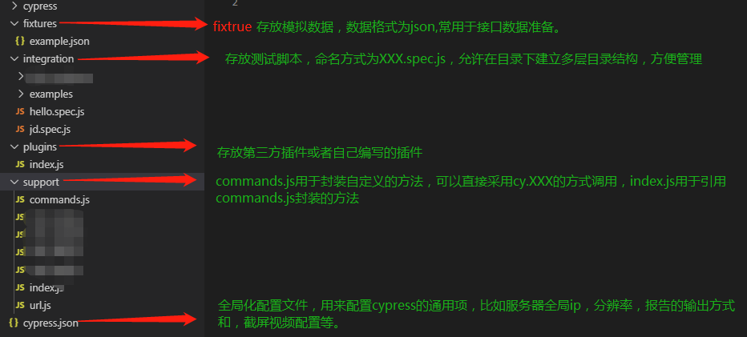

# UI automation testing in  Cypress [官方文档](https://www.cypress.io/)

## cypress

[cypress用例设计](https://docs.cypress.io/zh-cn/guides/getting-started/writing-your-first-test.html#)

[构建用例整体结构的语法](https://mochajs.org/#installation)

[cypress御用的断言库](https://www.chaijs.com/)

### 目录结构说明



### cypress处理uts用例的关注问题

1. 根据项目id获取项目下的用例集（dirids）
2. 通过dirids获取所有的用例（caseids）
3. 获取项目下所有可以执行用例的任务机器（这里需要存记是否配置了hosts）
4. 可组装使用pc和wap的界面，并启动浏览器（如何处理代理问题：多环境执行）
5. 执行用例步骤，并报告异常
6. 存留日志

关于解析器这块，是否沿用java版本的反射及递归逻辑处理？

### 关于UTS二次验证流程的cypress实践

1. 对uts的用例执行器进行cypress翻译
2. 执行uts的json用例执行，需要处理循环和参数获取

## cypress需要满足UI自动化测试的架构需求

1. 能够满足用例的快速构造
2. 支持命令行和ide的执行方式
3. 可定制的日志输出
4. 可配置的全局配置
5. 可配置的测试结果输出，包含：截图、录屏、报告整合
6. 支持定制的插件

## 首次安装使用

> 1. 前提安装：node、 npm(一般npm会在安装node.js封装好)
> 2. 创建一个目录 ，如 D:/Cypress
> 3. 进入该目录，执行命令 ```npm init ```，生成 package.json 文件
> 4. 接着执行命令 ```npm install cypress --save-dev```
> 5. 可能会报错 ```refusing to install package with name webpack under a package```
>  可能原因：因为用的是编译的文件包安装，里面可能存在名为 cypress 的项目而导致
>  解决：修改上面的 package.json文件中的 “name”: “cypress”，， 值改为其他的，比如"name": “cypress1”，然后再次执行安装命令即可进入下载
> 6. 下载完后，可打开cypress,打开有三种方式，介绍其中两种
> a. 管理员模式打开 cmd 窗口,执行命令 ```npx cypress open```
> b. 进入Cypress安装目录\node_modules\bin 目录，输入 cypress open 

除此之外，也可以配置package.json, 使用自定义命令打开
>```
>Cypress 允许配置  package.json 文件的 scripts 字段，来定义打开方式
>a. 进入 Cypress安装目录 ，打开 package.json 
>b. 在 scripts 下，添加 "cypress:open":"cypress open"  
>c. 使用 npm run cypress:open 自定义打开
>```
> 7. 创建cypress用例 ： 在目录integration 下，创建demo1.js, 编写测试代码
>```
>/// <reference types="Cypress" />
>describe('问问测试用例-首页', function() {
>    beforeEach(() => {
>          cy.visit('https://wenwen.test.com/')
>        })
>      it('首页-等你来回答模块检查', function() {
>        cy.get("div.home-section-main > h2.home-tit").its('text').eq.('等你来回答')
>        })
>    })
>```

## 报告依赖

生成json格式的报告，最后把json格式报告合并成一个，最终生成一个html报告，这在分布式执行的时候用得到

```shell
npm install --save-dev mocha mochawesome mochawesome-merge mochawesome-report-generator
```

## mochawesome-merge 合并报告

每个用例会生成一个json文件，最终我们合并成一个json文件，再把这个json报告文件生成一个html报告

```shell
cnpm mochawesome-merge out/results/*.json > merge-report.json
```

这样就会在项目目录生成一个 merge-report.json 文件

## 使用 [mochawesome-report-generator](https://github.com/adamgruber/mochawesome-report-generator) 生成 html 报告内容

```shell
cnpm mochawesome-report-generator merge-report.json
```

## cypress遇到的问题

### 1、条件测试

cypress 初衷是禁止条件测试的，断言、验证通过就是通过，不允许额外增加不通过的if条件；但是为了跑通 UTS 现有的selenium用例，加上了条件测试，就需要结合jquery来实现，会增加很多判断条件，通用性也不是很好；

其次，对于cypress自身的命令，即使失败，也不能添加.catch错误处理（自身命令会出现很多限制因素，下面会详细介绍）

### 2、异步执行和变量范围域的问题

异步执行
例如：

```shell
const ids = cy.get('#id')
#此处运行就会失败
ids.find('id2).click()
```

原因是cypress 命令在被调用时并不能马上执行，cypress 会先把所有命令排队，然后再执行，也就是说当cy.get('#id')被初次调用时，ids的值是undefined，故测试会失败。

变量域问题，赋值永远失败

cypress 读取数据库等引用第三方方法，都需要使用插件的方法来实现，方法写入到cy.tast(),否则直接在用例.js中require 会报错；

### 3、wap支持性不好

cypress 通过设置ua来模拟wap页面；不能操控chrome driver，会出现页面加载成功后，点击无法生效的情况，无法模拟 toggle device 手机点击
cy.viewport('iphone-x')只是对窗口进行长宽改变，若不设置ua，仍只是pc端页面
ua无法在cypress启动后进行配置，如Cypress.config('userAgent','xxxxxx'),只对当前操作页面生效，点击跳转、新开页面等，仍然是默认ua

### 4、select 元素无法点击

对于selenium来讲，只要提供元素标签，点击事件都可以触发，但是cypress并不可以，如cy.get('XXXXXselect').click()，会报错；要使用cy.get('XXXXXselect').select('')

### 5、无法切换窗口

cypress 希望每一个case在同一窗口下进行，若有点击跳转其他窗口的验证，只需获得a标签的href属性获得要跳转的url, 与预期的url进行比较；或 remove a标签的 (target)属性，防止新开窗口；至于在跳转后页面的操作，需要新开it ，作为新的case, 尽量保证每一个case 验证粒度最小化；

### 6、安全以及同源问题处理方法

跨域错误 ： 在```cypress.json``` 中加入 ```"chromeWebSecurity": false```

iframe 跨域导致页面不加载("frame-ancestors 'self'")：  对比每次url是否发生变化，写插件打开新tab加载页面，调整cypress作用页面，测试结束后，关闭自己打开的tab

### 7、cypress run 时初始化时间过长 [github](https://github.com/cypress-io/cypress/issues/2912)

每次 run case时，case 执行加载时间过长，大概在10-30s左右，影响测试效率

### 8、手动添加wait 

为了兼容不同case，只能手动添加wait 事件

解决方法：使用cypress-wait-until插件

### 9、升级cypress 版本报错

```shell
Failed to deserialize the V8 snapshot blob error
```

解决方法:  强制安装 [github](https://github.com/cypress-io/cypress/issues/5440)

```shell
npx cypress install --force
```

### 10、 非docker部署

直接在linux部署会出现依赖问题, 依赖没问题后又发现正常启动后，没有chrome 浏览器，还是使用docker

解决方法： install 就可以了

```shell
yum -y install libxkbcommon

```
